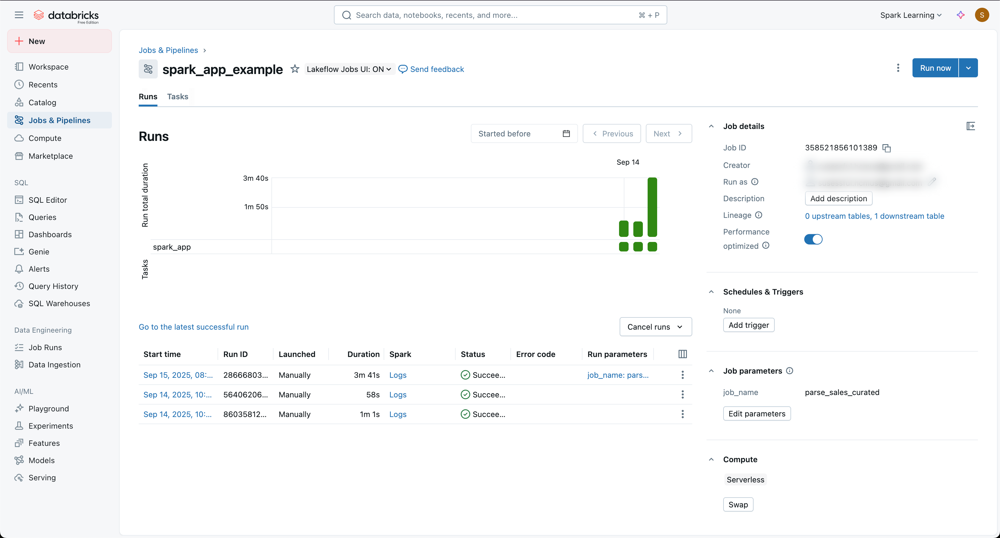
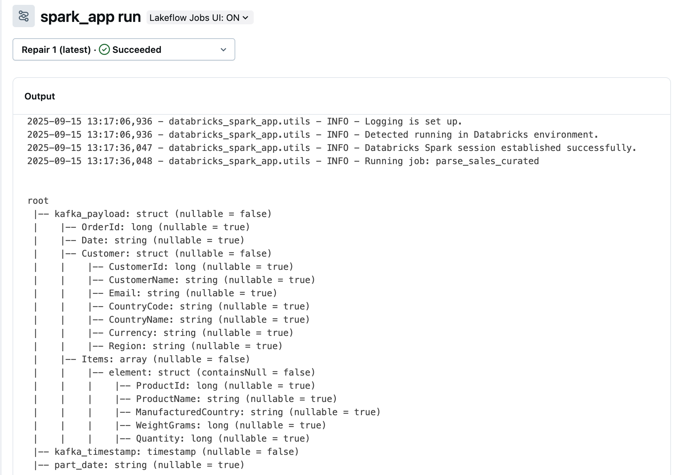

# Databricks Spark Application Starter Kit

[](https://databricks.com)
[](https://spark.apache.org/)
[](https://www.python.org/)


Databricks Spark Application Starter Kit is a starter codebase for building and deploying Apache Spark applications on Databricks with production-ready structure and best practices.

> [!NOTE]
> In short, this starter kit will help you to develop your Spark application locally and deploy it to Databricks Jobs with a single command, and schedule it to run periodically, using [Databricks Connect](https://docs.databricks.com/aws/en/dev-tools/databricks-connect/python/), [Databricks Unity Catalog](https://docs.databricks.com/aws/en/data-governance/unity-catalog), and [Databricks Jobs](https://docs.databricks.com/aws/en/jobs) (Python Wheel Task).

## Table of Contents

- [Databricks Spark Application Starter Kit](#databricks-spark-application-starter-kit)
  - [Table of Contents](#table-of-contents)
  - [Quick Start](#quick-start)
  - [Project Structure](#project-structure)
  - [Prerequisites for local development](#prerequisites-for-local-development)
  - [Development Setup](#development-setup)
  - [Managing Table Writes with `insert_overwrite` and `ManagedDataFrame`](#managing-table-writes-with-insert_overwrite-and-manageddataframe)
    - [1. Direct API with `insert_overwrite`](#1-direct-api-with-insert_overwrite)
    - [2. Class-based API with `ManagedDataFrame`](#2-class-based-api-with-manageddataframe)
    - [Quick Comparison](#quick-comparison)
  - [Support backfilling data with job parameters](#support-backfilling-data-with-job-parameters)
  - [Example jobs already included](#example-jobs-already-included)
  - [References](#references)

## Quick Start

Run a sample job locally: (make sure you have followed the [Development Setup](#development-setup) steps and setup `.env` file)

```bash
spark_app --job_name sample_simple_job
```

Deploy the sample job to Databricks Jobs:

```bash
databricks_deploy --job_name sample_simple_job
```

> [!NOTE]
> You can find the sample job code in `src/databricks_spark_app/jobs/sample_simple_job.py`.
> This only deploys the job to Databricks Jobs. You still need to schedule it in the Databricks UI under `Schedules & Triggers`.

## Project Structure

```bash
databricks-spark-app-starter/
├── src/databricks_spark_app/
│   ├── jobs/               # the only folder you mostly work on and care about the most
│   │   ├── sample_simple_job.py   # example spark job, the file name will be used as job name
│   │   └── ...
│   ├── io
│   │   ├── dataframe.py    # ManagedDataFrame class for schema and comments management
│   │   └── writer.py       # insert_overwrite function for writing data to tables   
│   ├── pipeline.py         # entry point for running spark jobs
│   ├── deploy.py           # script to deploy jobs to Databricks
│   ├── utils.py            # utility functions
│   └── config.py           # configuration management
└── ...                     # other project files
```

## Prerequisites for local development

- Python `3.12+`
- Databricks account with access to a workspace
  - You can sign up for a free edition: https://www.databricks.com/learn/free-edition
  - Generate a personal access token (PAT): https://docs.databricks.com/aws/en/dev-tools/auth#generate-a-token
- `uv` for python package management: https://docs.astral.sh/uv/installation

## Development Setup

tl;dr:
Clone the repo, install dependencies, set up environment variables, and start coding in `src/databricks_spark_app/jobs/`.

> [!IMPORTANT]
> If you are planning to change the folder name `databricks_spark_app` in the `src` directory, please make sure everywhere in the codebase is updated accordingly by searching for `databricks_spark_app`. (e.g `ctrl + shift + f` in VSCode)

1. Install dependencies:
   ```bash
   uv sync --all-groups --all-extras
   ```
   After that, a virtual environment will be created in the `.venv` directory.

2. Prepare environment variables:
   - Copy `.env.example` to `.env` and fill in your Databricks host and token.
      ```bash
      cp .env.example .env
      ```
   - Fill in your Databricks host and token in the `.env` file.
      ```bash
      DATABRICKS_HOST=your-databricks-host
      DATABRICKS_TOKEN=your-databricks-token
      ```
   - Source the `.env` file if needed:
      ```bash
      source .env
      ```

3. Develop your Spark application in the `src/databricks_spark_app/jobs/*.py` files with `pipeline` function as the entry point. Example:

   ```python
   # src/databricks_spark_app/jobs/sample_simple_job.py
   import logging

   from pyspark.sql import SparkSession, Window
   from pyspark.sql import functions as f

   logger = logging.getLogger(__name__)


   def pipeline():
      # ... your Spark job logic here ...
   ```

4. Test your Spark application locally by adding job name as a command-line argument. Example:
   ```bash
   spark_app --job_name sample_simple_job
   ```

   ```bash
   2025-09-15 20:35:28,415 - databricks_spark_app.utils - INFO - Logging is set up.
   2025-09-15 20:35:32,612 - databricks_spark_app.utils - INFO - Initialized Spark 4.0.0 session.
   2025-09-15 20:35:32,612 - databricks_spark_app.utils - INFO - Running job: sample_simple_job
   +------------------+
   |           message|
   +------------------+
   |Hello, Databricks!|
   +------------------+

   2025-09-15 20:35:33,505 - databricks_spark_app.jobs.sample_simple_job - INFO - Sample job completed successfully.
   ```
   Note: The job name should match the filename in `src/databricks_spark_app/jobs/`.

5. Deploy your Spark application to Databricks:
   ```bash
   databricks_deploy --job_name sample_simple_job
   ```

   This will package your application and deploy it to Databricks Jobs. You can verify the deployment in the Databricks UI under `Jobs & Pipelines`.

   

   > Job will be deployed as Python Wheel Task and will run on the latest Databricks Runtime with Spark `4.0+`, which supports Python `3.12+` and treats the job like a DAG in Airflow.

   

6. Schedule your job under `Schedules & Triggers` in the Databricks Jobs UI. 

   > You can also trigger the job manually from the UI or scheduled it via cron expression.

## Managing Table Writes with `insert_overwrite` and `ManagedDataFrame`

This starter kit provides two ways to manage writing data into Unity Catalog or Hive Metastore tables:

1. **Direct functional API with `insert_overwrite`**
2. **Class-based abstraction with `ManagedDataFrame`**

Choose whichever fits your workflow best.

### 1. Direct API with `insert_overwrite`

When to use: if your jobs are simple and you just need to persist results.

If you already have a Spark `DataFrame` and want to write it to a managed table with schema enforcement and comments:

```python
import logging
from pyspark.sql import SparkSession
from pyspark.sql import types as t
from databricks_spark_app.io.writer import insert_overwrite

logger = logging.getLogger(__name__)

def pipeline():
   spark = SparkSession.getActiveSession()

   df = spark.sql("""
   SELECT
         'Hello, Databricks!' AS message,
         CAST(CURRENT_DATE() AS STRING) AS part_date
   """)

   df.show(truncate=False)
   force_schema = t.StructType([
      t.StructField("message", t.StringType(), nullable=False),
      t.StructField("part_date", t.StringType(), nullable=False),
   ])
   spark.sql("CREATE DATABASE IF NOT EXISTS temp_db")
   insert_overwrite(
      fqtn="temp_db.hello_table",
      spark_df=df,
      force_schema=force_schema,
      table_comment="Sample table for insert overwrite demonstration",
      column_comments={
            "message": "A greeting message",
            "part_date": "Partition date",
      },
      partition_by=["part_date"],
   )

   logger.info("Sample job completed successfully.")
```

### 2. Class-based API with `ManagedDataFrame`

When to use: if your jobs are complex and you want to encapsulate logic, schema, and comments in one place.

* You want **strict schema management** (`table_schema` required).
* You want **column-level documentation** via `column_comments`.
* You want to follow a **standardized job template**.

You can extend `ManagedDataFrame` to define schema, comments, and transformation logic in one place.

This makes jobs **self-describing, reusable, and testable**.

```python
import logging
from pyspark.sql import SparkSession
from pyspark.sql import types as t
from databricks_spark_app.io.dataframe import ManagedDataFrame

logger = logging.getLogger(__name__)

class SampleHelloTable(ManagedDataFrame):
    table_comment = "Sample table for insert overwrite demonstration"
    column_comments = {
        "message": "A greeting message",
        "part_date": "Partition date",
    }
    table_schema = t.StructType([
        t.StructField("message", t.StringType(), nullable=False),
        t.StructField("part_date", t.StringType(), nullable=False),
    ])

    def process(self):
        spark = SparkSession.getActiveSession()
        return spark.sql("""
            SELECT
                'Hello, Databricks! From ManagedDataFrame' AS message,
                CAST(CURRENT_DATE() AS STRING) AS part_date
        """)

def pipeline():
    job = SampleHelloTable()
    job.insert_overwrite(fqtn="temp_db.hello_table", partition_by=["part_date"])
    logger.info("Sample job completed successfully.")
```

### Quick Comparison

| Feature                    | `insert_overwrite` (function) | `ManagedDataFrame` (class)    |
| -------------------------- | ----------------------------- | ----------------------------- |
| Minimal boilerplate        | Yes                           | No, requires class define     |
| Schema enforcement         | Manual                        | Automatic (`table_schema`)    |
| Column-level documentation | Manual                        | Automatic (`column_comments`) |
| Best for                   | Simple jobs                   | Complex/production jobs       |

## Support backfilling data with job parameters

You can define additional job parameters in `DatabricksAdditionalParams` in `config.py`. These parameters will be automatically added as command-line arguments when running the job locally or in Databricks Jobs. You can then access these parameters in your job code via Spark SQL variables with the syntax `` `params.<param_name>` ``. Note that the sign is the backtick (`` ` ``), not a single quote (`'`).

Example:

```python
spark.sql("""
   SELECT *
   FROM some_table
   WHERE part_date = `params.run_date`
""")
```

When running locally:

```bash
spark_app --job_name sample_run_date_job.py --run_date "2025-09-01"
``` 

Because the Spark Connect session doesn't support setting or changing Spark configurations, the only way to pass parameters is Spark variables (https://spark.apache.org/docs/4.0.0/sql-ref-syntax-ddl-declare-variable.html).

## Example jobs already included

In the `src/databricks_spark_app/jobs` folder, you will find several example jobs demonstrating different features:

```
├── jobs
│   ├── sample_insert_overwrite.py
│   ├── sample_managed_table.py
│   ├── sample_run_date_job.py
│   └── sample_simple_job.py
```

Just replace/delete these example jobs with your own job files as needed.

## References

- Databricks Jobs: https://docs.databricks.com/aws/en/jobs
- Databricks Connect For Python: https://docs.databricks.com/aws/en/dev-tools/databricks-connect/python/
- PySpark Documentation: https://spark.apache.org/docs/4.0.0/api/python/index.html
