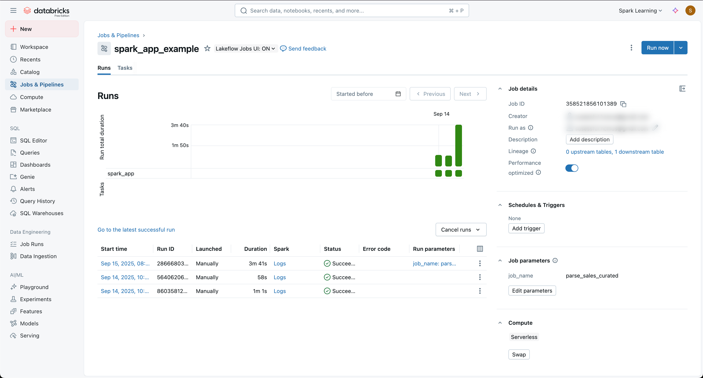
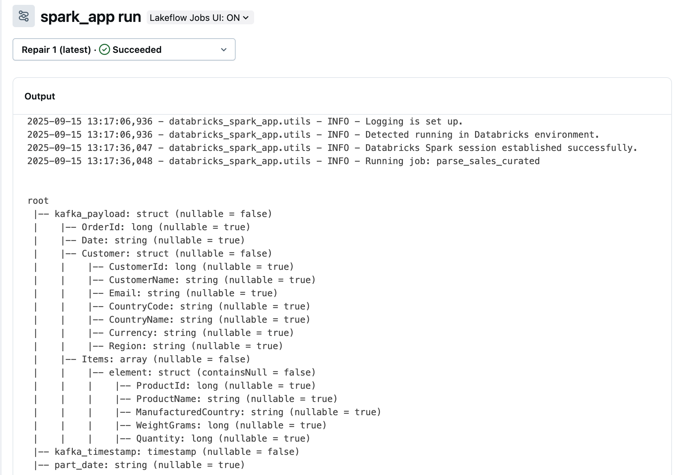

# Databricks Spark Application Starter Kit

[](https://databricks.com)
[](https://spark.apache.org/)
[](https://www.python.org/)
[](LICENSE)


Databricks Spark Application Starter Kit Starter kit for building and deploying Apache Spark applications on Databricks with production-ready structure and best practices.

> In short, this starter kit will help you to develop your Spark application locally and deploy it to Databricks Jobs with a single command, and schedule it to run periodically, using [Databricks Connect](https://docs.databricks.com/aws/en/dev-tools/databricks-connect/python/), [Databricks Unity Catalog](https://docs.databricks.com/aws/en/data-governance/unity-catalog), and [Databricks Jobs](https://docs.databricks.com/aws/en/jobs) (Python Wheel Task).

## Project Structure

```bash
databricks-spark-app-starter/
├── src/databricks_spark_app/
│   ├── jobs/               # define job module here
│   │   ├── sample_job.py   # example spark job, the file name will be used as job name
│   │   └── ...             
│   ├── pipeline.py         # entry point for running spark jobs
│   ├── deploy.py           # script to deploy jobs to Databricks
│   ├── utils.py            # utility functions
│   └── config.py           # configuration management
└── ...                     # other project files
```

## Prerequisites for local development

- Python `3.12+`
- Databricks account with access to a workspace
  - You can sign up for a free edition: https://www.databricks.com/learn/free-edition
  - Generate a personal access token (PAT): https://docs.databricks.com/aws/en/dev-tools/auth#generate-a-token
- `uv` for python package management: https://docs.astral.sh/uv/installation

## Development Setup

tl;dr:
Clone the repo, install dependencies, set up environment variables, and start coding in `src/databricks_spark_app/jobs/`.

> [!IMPORTANT]
> If you are planning to change the folder name `databricks_spark_app` in the `src` directory, please make sure everywhere in the codebase is updated accordingly by searching for `databricks_spark_app`. (e.g `ctrl + shift + f` in VSCode)

1. Install dependencies:
   ```bash
   uv sync --all-groups --all-extras
   ```
   After that, a virtual environment will be created in the `.venv` directory.

2. Prepare environment variables:
   - Copy `.env.example` to `.env` and fill in your Databricks host and token.
      ```bash
      cp .env.example .env
      ```
   - Fill in your Databricks host and token in the `.env` file.
      ```bash
      DATABRICKS_HOST=your-databricks-host
      DATABRICKS_TOKEN=your-databricks-token
      ```
   - Source the `.env` file if needed:
      ```bash
      source .env
      ```

3. Develop your Spark application in the `src/databricks_spark_app/jobs/*.py` files with `pipeline` function as the entry point. Example:

   ```python
   # src/databricks_spark_app/jobs/sample_job.py
   import logging

   from pyspark.sql import SparkSession, Window
   from pyspark.sql import functions as f

   logger = logging.getLogger(__name__)


   def pipeline():
      # ... your Spark job logic here ...
   ```

4. Test your Spark application locally by adding job name as a command-line argument. Example:
   ```bash
   spark_app --job_name sample_job
   ```

   ```bash
   2025-09-15 20:35:28,415 - databricks_spark_app.utils - INFO - Logging is set up.
   2025-09-15 20:35:32,612 - databricks_spark_app.utils - INFO - Initialized Spark 4.0.0 session.
   2025-09-15 20:35:32,612 - databricks_spark_app.utils - INFO - Running job: sample_job
   +------------------+
   |           message|
   +------------------+
   |Hello, Databricks!|
   +------------------+

   2025-09-15 20:35:33,505 - databricks_spark_app.jobs.sample_job - INFO - Sample job completed successfully.
   ```
   Note: The job name should match the filename in `src/databricks_spark_app/jobs/`.

5. Deploy your Spark application to Databricks:
   ```bash
   databricks_deploy --job_name sample_job
   ```

   This will package your application and deploy it to Databricks Jobs. You can verify the deployment in the Databricks UI under `Jobs & Pipelines`.

   

   > Job will be deployed as Python Wheel Task and will run on the latest Databricks Runtime with Spark `4.0+`, which supports Python `3.12+` and treats the job like a DAG in Airflow.

   

6. Schedule your job under `Schedules & Triggers` in the Databricks Jobs UI. 

   > You can also trigger the job manually from the UI or scheduled it via cron expression.

## References

- Databricks Jobs: https://docs.databricks.com/aws/en/jobs
- Databricks Connect For Python: https://docs.databricks.com/aws/en/dev-tools/databricks-connect/python/
- PySpark Documentation: https://spark.apache.org/docs/4.0.0/api/python/index.html
